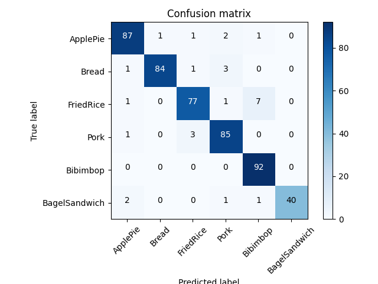

# ML-framework
- Install requirements.txt
- Prepare Dataset
- Use `train.py` for training and `eval.py` for evaluation.
- A sample folder structure is present in the repository for ref.


## Model Performance

With the same hyperparams, we can expect the following model performance on the given dataset.





## Parameters

Parameters are stored in config.py and they are required during the training and evaluation of the model. 

```


    "dataset_path": path of folder containing subfolder representing the classes,
    "validation_dataset_path": similar to dataset path but for images that you want to evaluate,


    "model": name of the mode (one of resnet18, resnet50, resnet34, resnet101)
    "num_classes": number of subfolder or classes in the dataset,
    "device":"cuda" if gpu is there else "cpu" ,
    "pretrained":true if you want pretrained finetuning else false will train from scratch,
    
    (following are modeling parameters, tune them as you wish.)

    "lr":0.0001,
    "momentum":0.9,
    "num_epochs":50,
    "image_size":[224,224],
    "train_test_split":0.5,
    "batch_size":8,
    "metric_thresh":0.9 (evaluation probability)
    

```


## To train the model 
 - Prepare the dataset. Create a superfolder containing subfolder whose name represents the classes. Inside the subfolder, put the respective images. 
 - Update the config.json. It contains all the parameters required to train the model.
 - Run `python train.py`.
 - Run `tensorboard --logdir runs` for accuracy visualization

Upon completion, your parameters will be dumped in a file called `latest_config.json`. You can rename it according to your experiment and store it. 

## Batch evaluation
- Run `eval.py`. By default it reads parameters from `latest_config.json`. But you can provide any other json file with model parameters and validation dataset path. Make sure to rename the file name in `eval.py`

## Probability based evaluation
- Use the notebook called `prediction_notebook.ipynb`.
- Provide either a folder containing images or a single image path.
- Specify the config file you want to use.
- Update the `path` variable.  
- Run the notebook
- You should be able to see the probability of the image/ images provided. 

